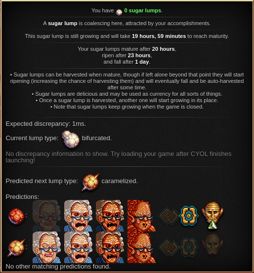

Choose Your Own Lump!
=====================

This is an add-on for [Cookie Clicker](https://orteil.dashnet.org/cookieclicker/)
that helps manipulating time
so that the right coalescing lump type can be chosen.


Getting Started (aka TL;DR)
===========================

1.  The number of grandmas,
    the stage of the grandmapocalypse,
    the slot that Rigidel is being worshipped,
    and the auras of the dragon
    can all be used to indirectly manipulate the type of the next coalescing sugar lump
    (similarly to how Force the Hand of Fate planners can be used to achieve big combos).

2.  This mod tries all possibilities and tells you which ones give the desired lump types.
    Look at the pictures below and try to understand what the mod is telling you;
    this information is available in the lump tooltip.

3.  Add the mod to your game following the [instructions below](#using-the-mod),
    choose your lump type and adjust your buildings/dragon etc. accordingly,
    **export your save**,
    wait for the lump to be auto-harvested,
    and then load your save game again.
    If everything went alright the type of your next lump is the one you choose!

4.  The most common issue is the discrepancy.
    In short, the game does not account for Javascript being slow,
    so sometimes the game misses the autoharvesting time by one or two millisecond.
    Reload your save game until the discrepancy matches the expected discrepancy
    (typically 1);
    the tooltip will provide instructions as needed.


Theory
======

Introduction
------------

_Coalescing sugar lumps_
are the sugar lumps that generate roughly once a day
right under the "Stats" button.
There are five types of sugar lumps:
normal, bifurcated, golden, meaty, and caramelized.
After the current sugar lump is harvested,
the next sugar lump starts growing.

The type of the next sugar lump is randomly determined as soon as the previous one is harvested,
although their appearance only starts differing after 57% of its growth has happened.
The key here is that the [random seed](https://en.wikipedia.org/wiki/Random_seed)
used to determine the next lump type
depends only on the game's random seed
and the time that the lump started growing.
Thus we can look at all the possibilities of time for the "birth" of the lump
and manipulate this value to give us the type we want.

The most obvious way of manipulating the sugar lump birth time
would be simply harvesting a ripe sugar lump at the right moment.
However,
the game uses millisecond precision for determining when the lump started growing,
so if we miss the mark by more than one millisecond we get an essentially random lump type.
We would need to write a script to achieve this super-human reaction time,
and I believe this is a bit too much cheating for my taste.

Therefore,
our goal is to manipulate the growing time of the current sugar lump
and let the game autoharvest it.

Manipulating the Next Lump Type
-------------------------------

The following factors affect the harvest time of the current lump and the type of the next lump:

- The time the current lump started coalescing;
- The heavenly upgrades Stevia Caelestis, Sucralosia Inutilis, and Sugar Aging Process;
- The game seed;
- Which slot Rigidel is in;
- The number of grandmas (if Sugar Aging Process is present);
- Dragon auras Dragon's Curve and Reality Bending; and
- The stage of the grandmapocalypse.

The first three are "persistent",
requiring an ascension to change;
the latter four are "transient" and can be changed within an ascension.

Knowing the factors above is exactly what we need to simulate the choice of the next lump type...
except for the discrepancy, explained below.
(In `ChooseYourOwnLump.js`,
this simulation is contained in the method `CYOL.PersistentState.prototype.predictLumpType`.)

Harvesting Methods
------------------

Besides clicking on the lump to harvest it,
a new sugar lump starts growing if the game is open and the lump falls
(i.e. it becomes overripe, so the lump is autoharvested),
or when a save game is loaded and the game notices the previous lump fell.
Two different pieces of code handle each of the latter two,
and I noticed that the timing of the first one
(lump falling while the game is open)
is unreliable.
So we will use the second one.

The plan goes as follows:
we choose a combination of the transient states that gives us the lump of our choice,
modify the state accordingly,
save the game (preferably exporting it),
wait for the autoharvest time to pass,
load the save game,
and hope for the best.

A Wrench in our Plans
---------------------

There is one issue, however:
the part of the game code which grants us lumps when the game is loaded
(`Game.loadLumps`)
calls `Date.now()` three times,
and Javascript is too slow to guarantee that all these three calls return the same number.
Typically there is a **discrepancy** of one or two milliseconds between these two calls.
This is where savescumming enters.
If we assume that the discrepancy will be 1
(i.e. one millisecond will elapse
between the first and last call of `Date.now()` in `Game.loadLumps`),
we can simulate the calculation of the next lump type accordingly,
and then we just need to load the game a few times until we actually get the simulated discrepancy.

In my machine,
roughly 50% of the time the discrepancy is 1 millisecond,
so this is the default setting for the mod.


Practice
========

This mod looks at every combination of "transient states"
(number of grandmas, dragon auras, Rigidel slot, grandmapocalypse stage),
filter the predictions to the lump types of your choice,
and displays them in the lump tooltip
(the box that appears when you hover the mouse over the sugar lump).
The tooltip looks like this:



The "Predicted next lump type" line says that,
if the player makes no changes to its save game,
then the next lump type will be normal.

The first line says that,
regardless of the stage of the grandmapocalypse,
if the dragon has both Dragon's Curve and Reality Bending as active auras,
and Rigidel is active on the ruby slot,
then the next sugar lump type will be caramelized.

The second line says that,
if the player progresses through the second or third "positive stages" of the grandmapocalypse
(displeased and angered grandmas, respectively),
the dragon has only Dragon's Curve as active aura,
and Rigidel is active on the ruby slot,
then the sugar lump will be meaty.

Here only one of the two relevant auras (Dragon's Curve and Reality Bending) is needed,
so this configuration works with a partially-trained dragon.
If the dragon is fully trained,
then the other aura must be set to something _other_ than reality bending.

**All of this assumes, of course,
that the discrepancy that happens when loading the save game
matches the one assumed during the calculations.**
Thus some savescumming may be needed to guarantee that the discrepancy matches the assumed value.
This value can be adjusted in the settings,
but I believe most users will want that value to be 1.

In the screen above,
the current lump type is normal,
as can be seen in the second line of the paragraph above the predictions.
This line will always say the type of the lump regardless of the growth stage.

Only the predictions whose lump types were selected by the user are shown.
The predictions which result in shortest lump growth time are shown first in the tooltip.

If the heavenly upgrade "Sugar Aging Process" is purchased,
then the number of grandmas matter for the sugar lump growth time.
The required number is displayed right after the colon:


Sometimes,
the predicted configuration will limit how far (or how early)
in the grandmapocalypse the game can be;
for example, in the last line of the tooltip above,
only the first three stages of the grandmapocalypse
(and Dragon's curve and reality bending, and Rigidel unslotted)
yield the chosen lump type.
If you are past that stage,
the only way of going back is to stop the grandmapocalypse
either through Elder Pledge or Elder Covenant.

In some rare cases,
the required stages are on "the middle".
For example,
in the second line above,
only stages 1 and 2 (awoken and displeased grandmas) work.

You can check the grandmapocalypse stage on the Status menu,
or by looking at the picture of the grandmas in your buildings list;
they will match the ones displayed in the tooltip.

Increasing the number of grandmas by 200 is equivalent to raising Rigidel one slot
(unslotted to Jade, Jade to Ruby, or Ruby to Diamond).
For example,
in the image above,
the third line is equivalent to using 378 grandmas instead of 578
but worshipping Rigidel in the Diamond slot.
They have exactly the same results,
so the mod only displays the one with the most grandmas.


Using the mod
=============

The best solution is adding
<https://staticvariablejames.github.io/ChooseYourOwnLump/ChooseYourOwnLump.js>
to [Cookie Clicker Mod Manager](https://github.com/klattmose/CookieClickerModManager).

Alternatively,
run
```javascript
    Game.LoadMod('https://staticvariablejames.github.io/ChooseYourOwnLump/ChooseYourOwnLump.js');
```
on your browser Javascript console,
or create a bookmarklet with the code
```javascript
    javascript:(function(){Game.LoadMod('https://staticvariablejames.github.io/ChooseYourOwnLump/ChooseYourOwnLump.js');}());
```


Changelog
=========

1.0.0
-----

Initial release.

1.0.1
-----

Funcionally equivalent states are no longer generated multiple times;
for example,
instead of generating a state with 500 grandmas and Rigidel on the ruby slot
and another state with 300 grandmas and Rigidel on the diamond slot,
only the former one is generated.

1.0.2
-----

States that differ only in the grandmapocalypse stage are now shown together.

More than half of the time all four stages of the grandmapocalypse yield the same lump.
This should help declutter the display screen.
However,
to display everything,
I made the sugar lump tooltip wider in a kludgey manner;
this might cause incompatibilities if any other mod messes with that tooltip.

1.0.3
-----

Update to Cookie Clicker 2.029, CCSE 2.017.

Nothing really changed sugar-lump-wise besides version numbers.

1.0.4
-----

Minor UI improvements.

1.0.5
-----

The discrepancy is now displayed in the lump tooltip.

1.1.0
-----

Released under GPLv3 or later.

Technically the minor version number should have been increased a few patch versions ago,
since more functionality was added
(significantly improved displaying of states and displaying the discrepancy).

1.1.1
-----

Fix visual bug regarding the display of the discrepancy.

1.1.2
-----

Warn the player if the Pantheon was not loaded when the lump type was being computed.

1.1.3
-----

Remove code injection to `Game.lumpTooltip` that showed the lump type,
as this information is already shown together with the discrepancy.


Known Bugs/Limitations
======================

The performance is abysmal:
it takes roughly 5 seconds on my machine to scan through all possibilities.
This is particularly bad when savescumming,
because the mod may try to re-scan all possibilities every time the save game is reloaded.


License
=======

Choose Your Own Lump is a Cookie Clicker add-on.
Copyright (C) 2020 Static Variable James

This program is free software: you can redistribute it and/or modify
it under the terms of the GNU General Public License as published by
the Free Software Foundation, either version 3 of the License, or
(at your option) any later version.

This program is distributed in the hope that it will be useful,
but WITHOUT ANY WARRANTY; without even the implied warranty of
MERCHANTABILITY or FITNESS FOR A PARTICULAR PURPOSE. See the
GNU General Public License for more details.

You should have received a copy of the GNU General Public License
along with this program. If not, see <https://www.gnu.org/licenses/>.
