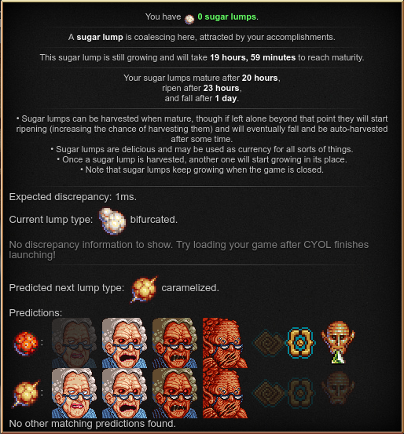
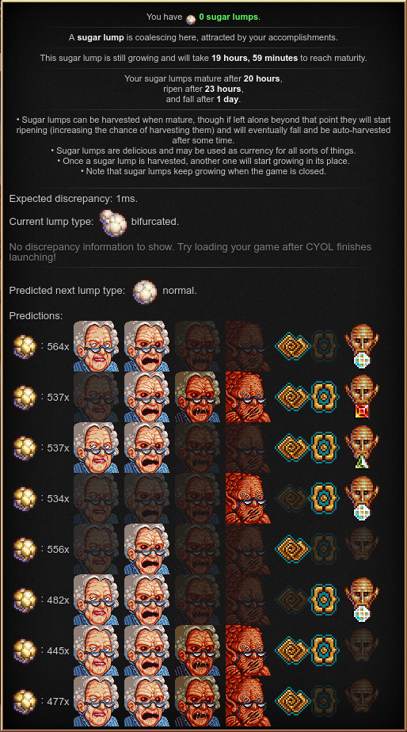

Choose Your Own Lump!
=====================

**[Changelog](CHANGELOG.md)
| [Theory](#theory)
| [Practice](#practice)
| [Using the mod](#using-the-mod)**

This mod for [Cookie Clicker](https://orteil.dashnet.org/cookieclicker/).
is a lump planner.
It tells you how to set up your game
so that the next sugar lump has the type of your choice.


Getting Started (aka TL;DR)
===========================

1.  The number of grandmas,
    the stage of the grandmapocalypse,
    the slot that Rigidel is being worshipped,
    and the auras of the dragon
    can all be used to indirectly manipulate the type of the next coalescing sugar lump.

2.  This mod tries all possibilities and tells you which ones give the desired lump types.
    Look at the pictures below and try to understand what the mod is telling you;
    this information is available in the lump tooltip.

3.  Add the mod to your game following the [instructions below](#using-the-mod),
    choose your lump type and adjust your grandmas, dragon etc. accordingly,
    **export your save**,
    wait for the lump to be auto-harvested,
    and then load your save game again.
    If everything went alright the type of your next lump is the one you choose!

4.  The most common issue is the discrepancy.
    This is a bug that makes the game miss the auto-harvest time,
    typically by one or two milliseconds.
    Reload your save game until the actual discrepancy matches the expected discrepancy;
    the lump tooltip will provide instructions as needed.


Theory
======

Introduction
------------

_Coalescing sugar lumps_
are the sugar lumps that generate roughly once a day
right under the "Stats" button.
They show up once you bake a billion cookies.
There are five types of sugar lumps:
normal, bifurcated, golden, meaty, and caramelized.
After the current sugar lump is harvested,
the next sugar lump starts growing.

The type of the next sugar lump is randomly determined as soon as the previous one is harvested,
although their appearance only starts differing after 43% of its growth has happened.
The key here is that the seed used to determine the next lump type
depends only on the game's random seed
and the time that the lump started growing.
Thus we can look at all the possibilities of time for the "birth" of the lump,
to figure out which ones gives the lump types we want.

Randomness and Planners
-----------------------

[Pseudorandom Number Generators (PRNGs)](https://en.wikipedia.org/wiki/Pseudorandom_number_generator)
are algorithms that generate a sequence of numbers that "look random".
Each PRNG has an internal state and an algorithm for updating it.
The initial state is the **seed** of the PRNG.
Whenever we ask a new number from the PRNG,
it generates one number according to its internal state,
hands it to us,
and update its internal state.
The key point is that both the generation and the update are completely deterministic:
if we know the algorithm and the internal state,
we can calculate the exact sequence of numbers produced by the PRNG.

Software that requires random numbers (like videogames)
almost always use PRNGs to get their random numbers.
In colloquial use we often call them just "RNG", because
[_true_ random number generators](https://en.wikipedia.org/wiki/Hardware_random_number_generator)
are rare.
The PRNG algorithm is usually known, but the internal state is not,
which makes them unpredictable enough for the vast majority of cases.

The deterministic nature of PRNGs gives rise to another way of using them:
"repeatable random numbers".
Cookie Clicker has many of those;
for example,
the outcome of spells from the Grimoire is decided this way.
The game takes its internal seed
(a random string of five letters, which is stored in the save file)
and the number of spells cast so far,
and use them to assemble the seed for a PRNG.
Then it uses this PRNG to essentially generate dice rolls which determine the outcome of the spell.

(It is a bit heavy-handed to use an entire PRNG just to generate a single spell outcome,
but the alternative of using a single PRNG to generate the entire sequence of spells
means that we cannot "start the sequence in the middle";
i.e. if we want to generate the 1000th number in the sequence,
we first have to generate the other 999.)

Because PRNGs are "complicated algorithms" (in a mathematically precise way),
the outcomes of grimoire spells will look unpredictable.
But because PRNGs are fully deterministic,
if we load the save from before casting the spell,
Cookie Clicker will assemble a PRNG that is identical to the one used before,
which will yield the same result.
As a consequence, we cannot savescum to try for a different spell outcome,
it will always be the same.

On the other hand,
if we know the internal game seed and the number of spells cast,
we can construct the same PRNG ourselves
and see what outcomes it's "dice rolls" (generated numbers) are.
We know how Cookie Clicker uses these random numbers to determine the next spell outcome,
so we can calculate this outcome ourselves,
which "predicts the future" in a sense.
This is the foundation of all Cookie Clicker planners.

Choose Your Own Lump is a lump planner.
The type of the next coalescing sugar lump is also a "repeatable random number",
and the seed is constructed from the internal game seed
and the time that the lump has started growing.
(This time is the number of milliseconds since January 1st, 1970,
a date known as "the Unix epoch".)
Since we know when the next lump will start growing,
we can calculate which type it will have.

The Savescumming Method
-----------------------

There are only two ways of harvesting a sugar lump:
letting it fall (auto-harvest), both online and offline,
and manually harvesting the lump by clicking on it.
Choose Your Own Lump relies on the former;
for completeness, this section discusses the latter.

Trying to find an "ideal millisecond" to harvest the lump is not viable.
Even if we knew the exact millisecond we had to click,
you are not fast enough to click on that millisecond
(this timeframe is at least half an order of magnitude faster than the refresh rate
of even high-refresh rate monitors),
so you'd need to use an autoclicker of sorts to time this click,
and good luck synchronizing the two processes with sub-millisecond precision.

So we could do trial and error.
Click on the lump to harvest it,
and check if the lump is of the desired type.
If it is not, we reload the save and try again.
There are mods who automate this sort of savescumming
(for example <https://github.com/sky-noname/SugarScum>).
Note that Cookie Clicker does not tell you the lump type right away
(it only does so after the lump is 43% (3/7) through its auto-harvest time),
so you need to either directly inspect `Game.lumpCurrentType`,
or use save editors or mods.

Alternatively,
you can harvest the lump,
export the save game to a file named `save1.txt`,
reload to before the lump was harvested,
harvest again and save to `save2.txt`, and so on,
creating hundreds of save files.
Then,
some ten hours later
(after the lumps are all past the 43% mark),
you can open the save files one-by-one until some save file has the desired lump type.
This method does not need to inspect the save file or use external tools,
but it is more time consuming than the previous method.

Choose Your Own Lump uses the other lump harvesting method.
We adjust the save file to have the "correct" lump time,
and wait for it to fall (and be auto-harvested) offline.

Note that letting it fall and be auto-harvest whilst online is not viable.
Online auto-harvesting is handled by the function `Game.doLumps`,
which is triggered once every 33ms (as part of `Game.Loop()`).

Manipulating the Next Lump Type
-------------------------------

The lump type is calculated by `Game.computeLumpType()`.

The following factors affect the harvest time of the current lump and the type of the next lump:

- The time that the current lump started growing.
- The internal game seed.
  - I.e. `Game.seed`, a randomly-chosen five-letter string,
    which changes only when ascending and is recorded in the save file.
- The heavenly upgrades Stevia Caelestis, Sucralosia Inutilis, and Sugar Aging Process.
- Which slot Rigidel is in.
  - Note that the dragon aura Supreme Intellect can (in a way) change where Rigidel is slotted.
- The number of grandmas (if Sugar Aging Process is present).
  - Recall that this effect is capped at 600 grandmas.
- Dragon auras Dragon's Curve and Reality Bending.
- The stage of the grandmapocalypse.

(This is an exhaustive list.)

Knowing the factors above is exactly what we need to simulate the choice of the next lump type...
except for the discrepancy, explained below.
(In the code of Choose Your Own Lump,
this simulation is contained in [src/planner/core.ts](src/planner/core.ts)
and [src/planner/processing.ts](src/planner/processing.ts).)

A Wrench in our Plans: The Discrepancy Bug
------------------------------------------

This is a bug in the function `Game.loadLumps`,
which handles offline auto-harvesting.

This function calls `Date.now()` twice.
`Date.now()` returns the current time,
down to millisecond precision.
If the two calls happen in the same millisecond,
all is good:
the next sugar lump starts growing the exact moment that the previous one was auto-harvested.
However,
if the two calls happen in different milliseconds,
the next lump will start growing a few milliseconds late.
This difference between when the lump actually started growing
and when it theoretically should have had
is the **discrepancy**,
and it exactly matches the time elapsed between the two `Date.now()` calls.

For regular gameplay,
sugar lumps starting growing a few milliseconds late is inconsequential,
but for us the millisecond is used as part of the seed,
so we need to compensate for it.
This is the "discrepancy" setting in the options menu.
By default,
Choose Your Own Lump assumes that
there will be a 1ms discrepancy between actual and theoretical lump times,
and adjusts the lump times accordingly when calculating the type of the next lump.

Unfortunately the discrepancy is not deterministic
--- it essentially depends on how fast the JavaScript engine
executes the code between the two `Date.now()` calls,
which in turn is affected by processor speed, current CPU load etc.
Hence some savescumming might be necessary to ensure that the lump actually has the desired type.
Choose Your Own Lump calculates and displays the discrepancy,
so you can adjust the assumed discrepancy accordingly.
If you are on a fast computer and using it exclusively for Cookie Clicker,
you may want to experiment lowering the discrepancy to 0ms.
If your computer is consistently slow,
you can increase it to a value you observe more often.

The discrepancy bug is discussed in detail
(including code analysis)
in <https://github.com/staticvariablejames/cookie-connoisseur/blob/master/doc/discrepancy.md>.


Practice
========

This mod looks at every combination of "transient states"
(number of grandmas, dragon auras, Rigidel slot, grandmapocalypse stage),
filters the predictions to the lump types of your choice,
and displays them in the lump tooltip
(the box that appears when you hover the mouse over the sugar lump).
The tooltip looks like this:



The "Predicted next lump type" line says that,
if the player makes no changes to its save game,
then the next lump type will be caramelized.

The first line says that,
if the player is in stages 1, 2 or 3 of the grandmapocalypse
(awakened, displeased, or angered grandmas),
Rigidel active in the jade slot,
and the dragon has only Reality Bending as the active aura,
then the next sugar lump type will be meaty.

The second line says that,
regardless of the stage of the grandmapocalypse,
if Rigidel is inactive
and the dragon has neither Dragon's Curve nor Reality Bending as active auras,
then the sugar lump will be caramelized.

For the first line,
only one of the two relevant auras (Dragon's Curve and Reality Bending) is needed,
so this configuration works with a partially-trained dragon.
If the dragon is fully trained,
then the other aura must be set to something _other_ than Dragon's Curve.

**All of this assumes, of course,
that the discrepancy that happens when loading the save game
matches the one assumed during the calculations.**
Thus some savescumming may be needed to guarantee that the discrepancy matches the assumed value.
This value can be adjusted in the settings,
but I believe most users will want that value to be 1.

In the screen above,
the current lump type is bifurcated,
as can be seen in the second line of the paragraph above the predictions.
This line will always say the type of the lump regardless of the growth stage.

Only the predictions whose lump types were selected by the user are shown.
The predictions which result in shortest lump growth time are shown first in the tooltip.

If the heavenly upgrade "Sugar Aging Process" is purchased,
then the number of grandmas matter for the sugar lump growth time.
The required number is displayed right after the colon:



Sometimes,
the predicted configuration will limit how far (or how early)
in the grandmapocalypse the game can be;
for example, in the first line of the tooltip above,
only the first two stages of the grandmapocalypse
(and Dragon's Curve active, and Rigidel in the diamond slot)
yield the golden lump type.
If you are past that stage,
the only way of going back is to stop the grandmapocalypse
either through Elder Pledge or Elder Covenant.

You can check the grandmapocalypse stage on the Status menu,
or by looking at the picture of the grandmas in your buildings list;
they will match the ones displayed in the tooltip.

In some rare cases,
the required stages are on "the middle".
For example,
in the fifth line above,
only stage 1 (awoken grandmas) work.
If you are past this stage,
the only way of still getting the golden lump is to use the Elder Covenant
to get out of the grandmapocalypse,
then revoking the elder covenant to start the grandmapocalypse again,
and exporting the save and quitting the game before the grandmapocalypse progresses to stage 2.
This will "freeze" the grandmapocalypse until the game is reopened,
allowing the lump to be harvested under stage 1.

Increasing the number of grandmas by 200 is equivalent to raising Rigidel one slot
(unslotted to Jade, Jade to Ruby, or Ruby to Diamond).
For example,
in the image above,
the second line is equivalent to using 337 grandmas instead of 537,
but worshipping Rigidel in the Diamond slot.
They have exactly the same results,
so the mod only displays the one with the most grandmas.


Using the mod
=============

The best solution is adding
<https://staticvariablejames.github.io/ChooseYourOwnLump/ChooseYourOwnLump.js>
to [Cookie Clicker Mod Manager](https://github.com/klattmose/CookieClickerModManager).

Alternatively,
run
```javascript
    Game.LoadMod('https://staticvariablejames.github.io/ChooseYourOwnLump/ChooseYourOwnLump.js');
```
on your browser Javascript console,
or create a bookmarklet with the code
```javascript
    javascript:(function(){Game.LoadMod('https://staticvariablejames.github.io/ChooseYourOwnLump/ChooseYourOwnLump.js');}());
```


License
=======

Choose Your Own Lump is a Cookie Clicker add-on.
Copyright (C) 2020 Static Variable James

This program is free software: you can redistribute it and/or modify
it under the terms of the GNU General Public License as published by
the Free Software Foundation, either version 3 of the License, or
(at your option) any later version.

This program is distributed in the hope that it will be useful,
but WITHOUT ANY WARRANTY; without even the implied warranty of
MERCHANTABILITY or FITNESS FOR A PARTICULAR PURPOSE. See the
GNU General Public License for more details.

You should have received a copy of the GNU General Public License
along with this program. If not, see <https://www.gnu.org/licenses/>.
